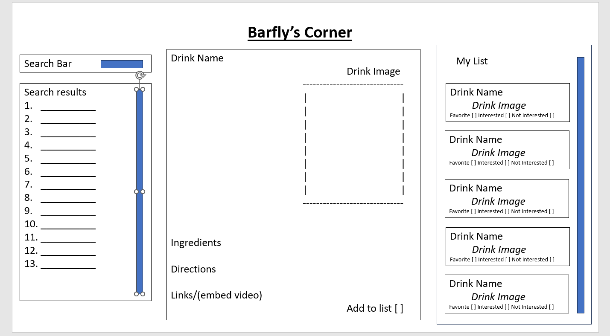

# Collab-Project-1
Barfly's Corner

## Description
<b>sketch</b>

##

This is a single-page application pulling data from 2 third-party server-side: [API Cocktail DB](https://rapidapi.com/thecocktaildb/api/the-cocktail-db) to provide a search for different alcoholic drinks as well as their ingredients and directions in making. 

In addition, the User can store their interested/favorite/tested drinks in their `local storage` to be repopulated at a later time.

## Usage
<u>User Story: </u>

AS A person over 21 years old
I WANT a responsive website
SO THAT I can look up different drink recipes and add them to my favorites

<u>Acceptance Criteria:</u>

`GIVEN` a recipe dashboard with form input
`WHEN` I search for a alcoholic drink or ingredient to a cocktail
`THEN` I am presented different drinks and the drink is added to the search history
`WHEN` I view the results
`THEN` I am presented cards that contain the drink name, a picture, and a quick description 
`WHEN` I view a card
`THEN` the selected card moves to the top and is expanded to show more information such as the ingredients, instructions and a link to a youtube video. 
`WHEN` I click on the favorite button 
`THEN` the card is moved to the favorites sidebar
`WHEN` I click on the checkmark
`THEN` it is presented as done 

## License

MIT License

Copyright (c) [2024] [Stephen Wei]

Permission is hereby granted, free of charge, to any person obtaining a copy
of this software and associated documentation files (the "Software"), to deal
in the Software without restriction, including without limitation the rights
to use, copy, modify, merge, publish, distribute, sublicense, and/or sell
copies of the Software, and to permit persons to whom the Software is
furnished to do so, subject to the following conditions:

The above copyright notice and this permission notice shall be included in all
copies or substantial portions of the Software.

THE SOFTWARE IS PROVIDED "AS IS", WITHOUT WARRANTY OF ANY KIND, EXPRESS OR
IMPLIED, INCLUDING BUT NOT LIMITED TO THE WARRANTIES OF MERCHANTABILITY,
FITNESS FOR A PARTICULAR PURPOSE AND NONINFRINGEMENT. IN NO EVENT SHALL THE
AUTHORS OR COPYRIGHT HOLDERS BE LIABLE FOR ANY CLAIM, DAMAGES OR OTHER
LIABILITY, WHETHER IN AN ACTION OF CONTRACT, TORT OR OTHERWISE, ARISING FROM,
OUT OF OR IN CONNECTION WITH THE SOFTWARE OR THE USE OR OTHER DEALINGS IN THE
SOFTWARE.